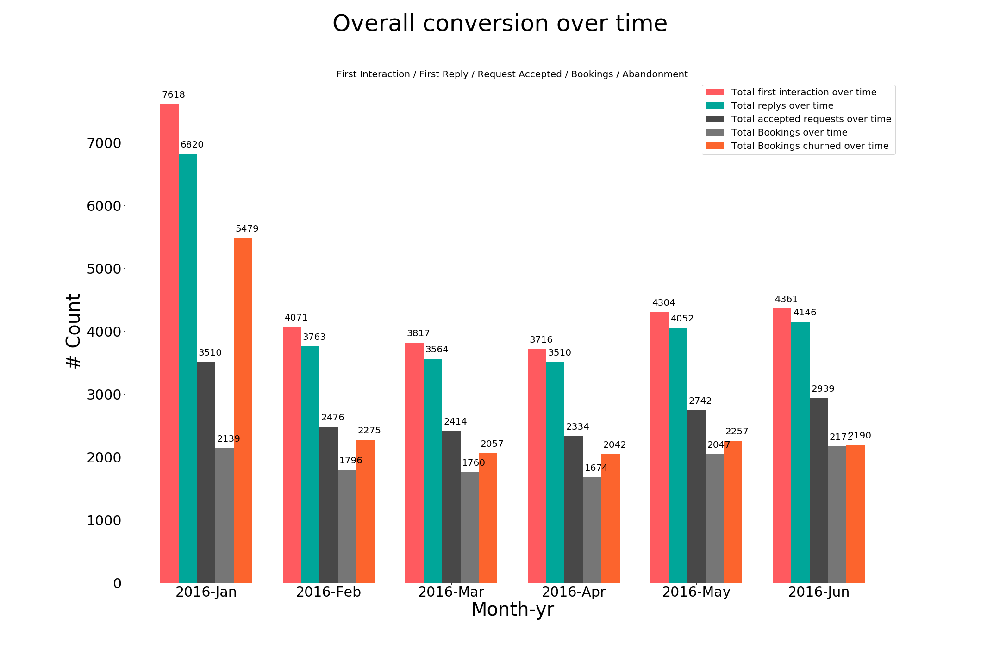
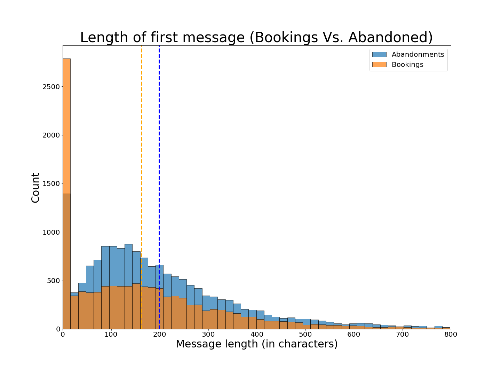
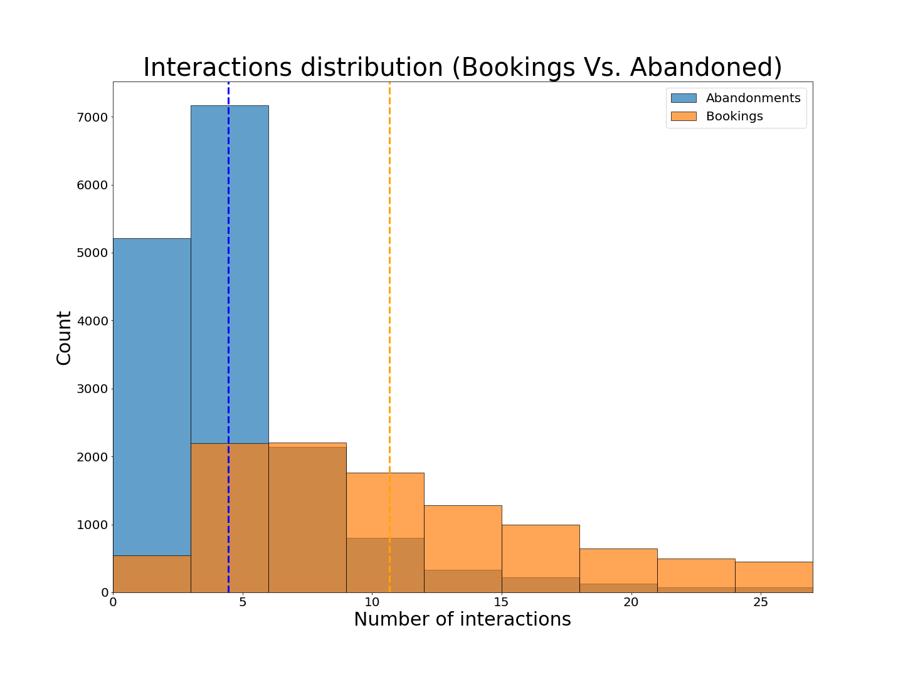
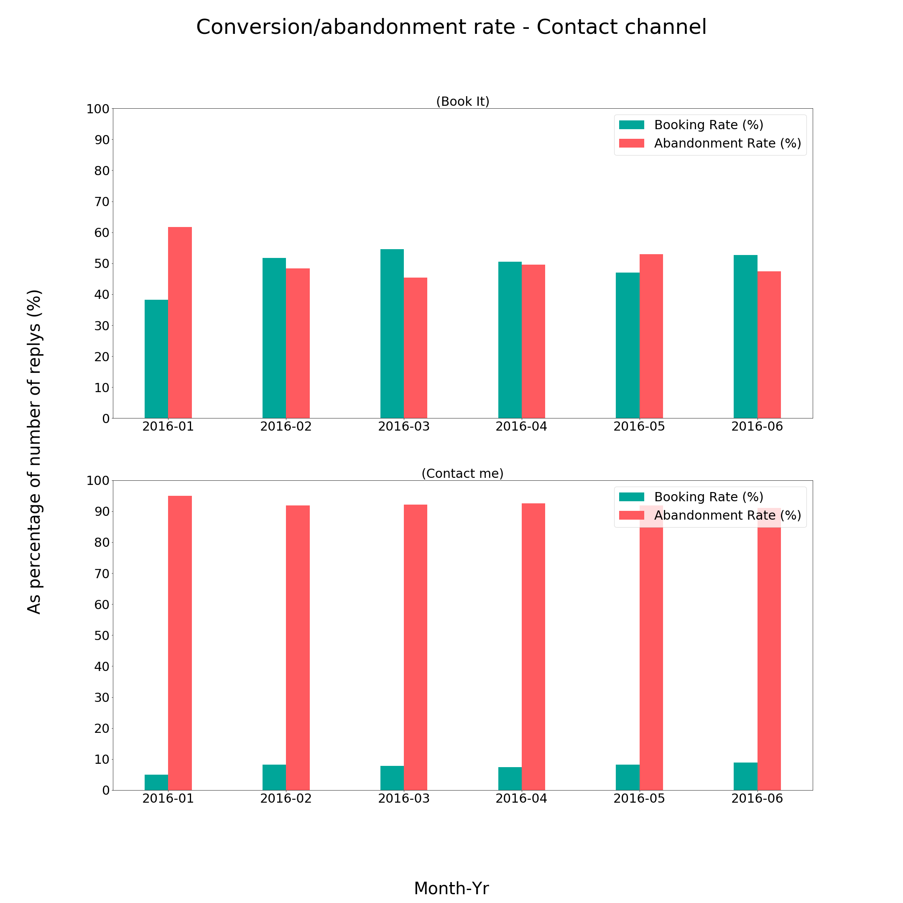
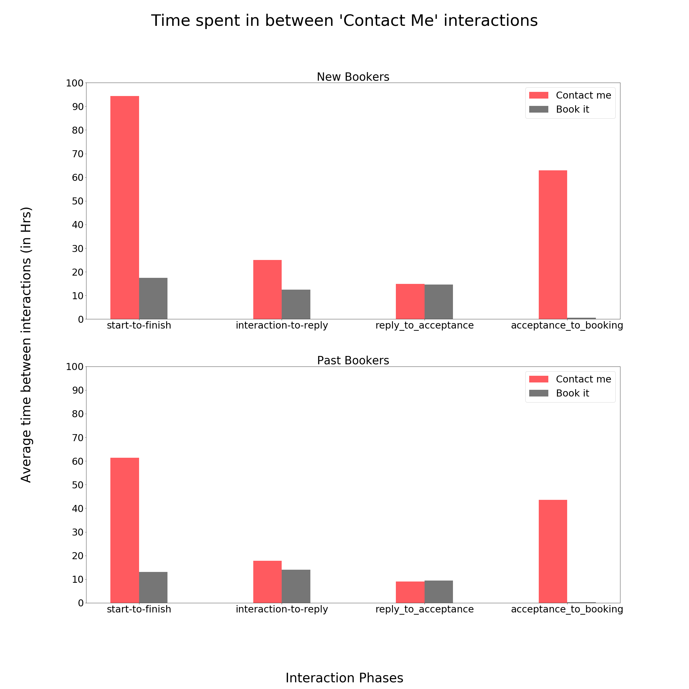
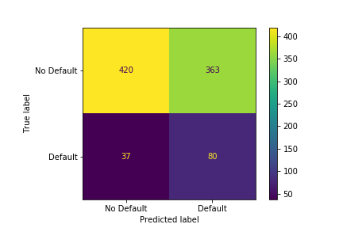
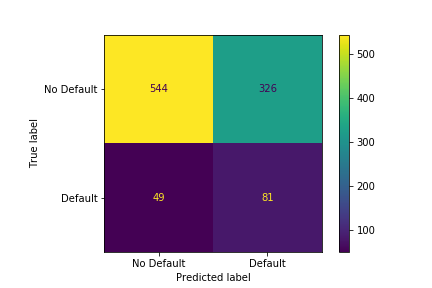

# Case Studies

## **Table of contents** <a name="top"></a>
1. [Airbnb - EDA](#airbnb)
2. [Buildzoom - Classification](#buildzoom)
3. [DataRobot - Classification](#datarobot)

## 1. Airbnb <a name="airbnb"></a>
[Code Link](https://github.com/NikhilSawal/data_science_case_studies/tree/master/airbnb/plots)

### 1.1 Problem
The product and operations team at Airbnb wants a detailed analysis of their guest host matching system in an attempt to grow bookings at Rio. The team wants to
1. Track a few KPI's that would help them monitor the success of the teams efforts in improving guest host matching.

2. Gain a deeper understanding of what areas to invest. Come up with a few recommendations, business initiative and product changes and demonstrate the rationale behind the recommendations.

### 1.2 Analysis

#### 1.2.1 KPI's

1. Conversion rate (%)

   * Across different stages of communication between guest & host, from **`first interation -> first reply -> acceptance -> booking/abandoned`**
   * Across contact channel types (contact_me, book_it, instant_book)
   * Across user type (New vs. Returning)
   * Across room types (Private room vs. Entire Apt vs. Shared room)


2. Average time between interactions

    * Across user-type and channel-type


3. \# Interactions and # Characters in guests opening remark (Bookings vs. Abandoned)

#### 1.2.2 Recommendations

1. **Make suggestions to keep the interactions engaging**

    On an overall level, there is a massive drop in the number of accepted requests once we get past the reply phase. Providing sample suggestions to both guest and host could improve the chances of booking.



The following distributions plots provide further evidence to come up with measures to improve engagement.
1. To make a good first impression, the opening message should have no more than ~180 characters.

2. Also all the successful bookings have shown little over 10 interactions.





2. **"Contact_me" performs poorly**

    Looking at the abandonment rate in the figure below, we see that "Contact_me" channel type has 10 times the abandonment rate as compared to "book_it".

    >*Note: The abandonment rate is a percentage of the total number of interactions started.*





Digging a bit deeper, the following plot shows the time spent in number of hours between different phases of the interaction for new vs. returning buyers. We clearly see that average time for "Contact_me" between the phases is well over a day for both types of buyers, which provides further evidence against the channel.


  

## 2. Buildzoom  <a name="buildzoom"></a> - [Top](#top)
[Code Link](https://github.com/NikhilSawal/data_science_case_studies/tree/master/buildzoom)


### 2.1 Problem Statement

Buildzoom gets data on building permits and wants to build a classifier that can correctly identify of the permit. The permit maybe of several types, but Buildzoom, wants a **binary classification** that can identify if a permit is ```(ELECTRICAL/NON-ELECTRICAL).```

### 2.2 Input Data
| Data Column | Description |
| ----------- | ----------- |
| License Type | Types of license associated with the property (Electrical contractor license, Speciality contractor license) |
| Business Name | Name of business |
| Legal Description | Legal address/block information |
| Description | describes work that need to be done eg: Install low voltage security system |
| Type (y) | ELECTRICAL/NON-ELECTRICAL |
| Subtype | Commercial/Single Family |
| Job Value | Value associated with the job |

### 2.3 Technologies
> Python libraries: Pandas, NumPy, Scikit-learn, NLTK, XGBoost, Regex

> [EDA Code](https://github.com/NikhilSawal/data_science_case_studies/tree/master/buildzoom)  
> [Machine Learning Code](https://github.com/NikhilSawal/data_science_case_studies/blob/master/buildzoom/solution.ipynb)

### 2.4 References
1. StatQuest: [https://www.youtube.com/watch?v=GrJP9FLV3FE&t=2217s](https://www.youtube.com/watch?v=GrJP9FLV3FE&t=2217s)
2. Data School: [https://www.youtube.com/watch?v=irHhDMbw3xo&t=135s](https://www.youtube.com/watch?v=irHhDMbw3xo&t=135s)


## 3. DataRobot  <a name="datarobot"></a> - [Top](#top)

[Code Link](https://github.com/NikhilSawal/data_science_case_studies/tree/master/datarobot)

DataRobot wants to build a classification model to predict if an applicant is going to default on loan or not. Which loan applicants are most profitable and worthy of lending money to?

Following snippet of code shows the data dictionary. `is_bad` is the binary classification variable we want to predict. Based on some EDA the data set is highly imbalanced, so we need to make sure that we are using evaluation metrics that accounts for it.

```python
import pandas as pd

data_dict = pd.read_csv('/datarobot/data/data_dictionary.csv')
print(data_dict)
```

### XGBoost

XGBoost model was trained to maximize sensitivity/recall for prediction, because of all the one's that defaulted we want the capacity to predict most of them ~70% or higher prediction accuracy.

After performing Grid search for hyper-parameter tuning and some amount of manual tuning, we get the following confusion matrix for our validation and test set.

|  |
|:--:|
| *Figure 1: Validation set - Confusion matrix* |

|  |
|:--:|
| *Figure 2: Test set - Confusion matrix* |

We also need to figure out the set of features that are predictive of our target variable i.e `is_bad`.

|  |
|:--:|
| *Figure 3: Feature Importance* |
