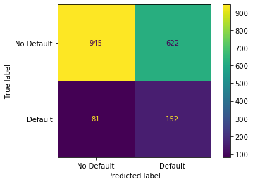
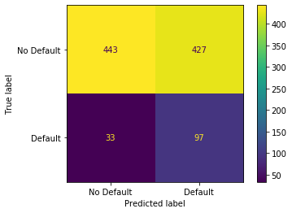
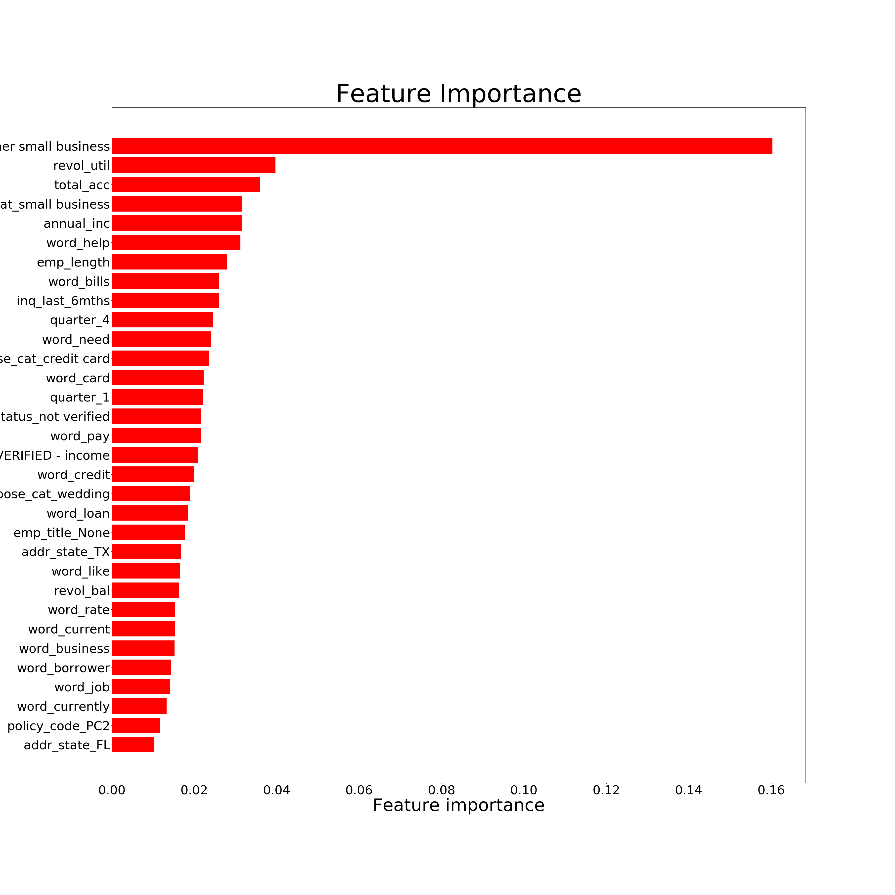
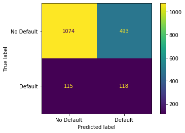
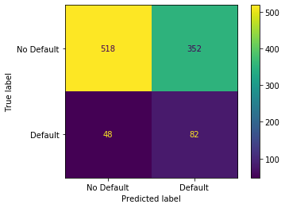

# 1. Import libraries


```python
import re
import nltk

import pandas as pd
import numpy as np
import matplotlib.pyplot as plt

from nltk.corpus import stopwords
from nltk.tokenize import word_tokenize, sent_tokenize
from nltk.stem import PorterStemmer, SnowballStemmer, WordNetLemmatizer

import xgboost
from xgboost import XGBClassifier

from sklearn.preprocessing import MinMaxScaler
from sklearn.preprocessing import OneHotEncoder
from sklearn.model_selection import train_test_split, GridSearchCV
from sklearn.compose import make_column_transformer
from sklearn.pipeline import make_pipeline
from sklearn.feature_extraction.text import TfidfVectorizer
from sklearn.metrics import confusion_matrix, accuracy_score, plot_confusion_matrix

pd.set_option('display.max_columns', 500)
pd.set_option('display.max_rows', 50000)
```

# 2. Import data


```python
df = pd.read_csv('data/dataset.csv')
```

# 3. Employer Title


```python
def emp_title(data, pattern, category_name):
    """
    Find patterns and return a list with the common category name for
    different patterns. For eg: If 'Walmart' appears in the following
    formats ('walmart', 'Wal-Mart', 'Walmart') it will be set to Walmart.
    """
    unique_names = data['emp_title'].unique()
    matches = [pattern.findall(i) for i in unique_names if len(pattern.findall(i)) > 0]
    matches = [item for l in matches for item in l]
    return [category_name if i in matches else i for i in data['emp_title']]


def emp_title_patterns(data, col_name):
    """
    This function applies manually identified patterns of most common
    employer title and replace the remaining with Others!!
    """

    # US Army
    pattern = re.compile(r'[a-zA-Z\S]*^[uU][a-zA-Z\s\S]+[Aa][Rr][Mm][Yy][a-zA-Z\S]*')
    data.loc[:,col_name] = emp_title(data, pattern, 'U.S. Army')

    # US Navy
    pattern = re.compile(r'^[uU][a-zA-Z\s\S]+[Nn][Aa][Vv][Yy][a-zA-Z\S]*')
    data.loc[:,col_name] = emp_title(data, pattern, 'U.S. Navy')

    # Walmart
    pattern = re.compile(r'^[Ww][Aa][a-zA-Z\S]+[tT]$[a-zA-Z\S]*')
    data.loc[:,col_name] = emp_title(data, pattern, 'Walmart')

    # Banks
    pattern = re.compile(r'[a-zA-Z\S\s]*[Bb][Aa][Nn][Kk][a-zA-Z\S\s]*')
    data.loc[:,col_name] = emp_title(data, pattern, 'Banks')

    # AT&T
    pattern = re.compile(r'[a-zA-Z\S\s]*[Aa][Tt][&n][Tt][a-zA-Z\S\s]*')
    data.loc[:,col_name] = emp_title(data, pattern, 'AT&T')

    # Air Force
    pattern = re.compile(r'[a-zA-Z\S\s]*Force[a-zA-Z\S\s]*')
    data.loc[:,col_name] = emp_title(data, pattern, 'Air Force')

    # USPS
    pattern = re.compile(r'^[Uu][a-zA-Z\S\s]*[Pp][Oo][Ss][Tt][Aa][Ll][a-zA-Z\S\s]*')
    data.loc[:,col_name] = emp_title(data, pattern, 'USPS')

    # USPS
    pattern = re.compile(r'^[Uu][Ss][Pp][Ss]')
    data.loc[:,col_name] = emp_title(data, pattern, 'USPS')

    # Chase Bank
    pattern = re.compile(r'[a-zA-Z\S\s]*[Cc]hase[a-zA-Z\S\s]*')
    data.loc[:,col_name] = emp_title(data, pattern, 'J.P. Morgan Chase')

    # IBM
    pattern = re.compile(r'[a-zA-Z\S\s]*[Ii][Bb][Mm][a-zA-Z\S\s]*')
    data.loc[:,col_name] = emp_title(data, pattern, 'IBM')

    # University
    pattern = re.compile(r'[a-zA-Z\S\s]*[Uu][Nn][Ii][Vv][Ee][Rr][Ss][Ii][Tt][Yy][a-zA-Z\S\s]*')
    data.loc[:,col_name] = emp_title(data, pattern, 'University')

    # Airlines
    pattern = re.compile(r'[a-zA-Z\S\s]*[Aa]irline[s]*[a-zA-Z\S\s]*')
    data.loc[:,col_name] = emp_title(data, pattern, 'Airlines')

    # The Home Depot
    pattern = re.compile(r'[a-zA-Z\S\s]*[Hh][Oo][Mm][Ee]\s[Dd][Ee][Pp][Oo][Tt][a-zA-Z\S\s]*')
    data.loc[:,col_name] = emp_title(data, pattern, 'The Home Depot')

    # Other
    top_category = ['None', 'Banks', 'University', 'U.S. Army', 'Air Force', 'USPS', 'Airlines', 'Walmart', 'J.P. Morgan Chase', 'IBM', 'U.S. Navy', 'The Home Depot', 'AT&T']
    data.loc[:,col_name] = ['Other' if i not in top_category else i for i in data.loc[:,col_name]]

    return data[col_name]
```

# 4. Notes


```python
def lambda_nltk_notes(data, col_names):

    data.loc[:, col_names] = data[col_names].fillna('None')
    stop_words = stopwords.words('english')
    stop_words.append('br/')
    special_char = re.compile(r'[\W]')
    ps = PorterStemmer()
    lemmatizer = WordNetLemmatizer()

    sample = []
    for index, note in enumerate(data[col_names]):
        word_tokens = word_tokenize(note)
        no_stops = [i for i in word_tokens if i.lower() not in stop_words]
        no_special = [special_char.sub('',i) for i in no_stops if special_char.sub('',i) != '']
#         stem_lemma = " ".join(ps.stem(lemmatizer.lemmatize(i.lower())) for i in no_special)
        stem_lemma = " ".join(i.lower() for i in no_special)
        sample.append(stem_lemma)

    return sample

```

# 5. Data Preprocessing


```python
def data_preprocessiong(data):

    # emp_title - CATEGORICAL
    data.loc[:,'emp_title'] = data['emp_title'].fillna('None')
    data.loc[:,'emp_title'] = emp_title_patterns(data, 'emp_title')

    # emp_length - NUMERICAL
    data.loc[:,'emp_length'] = [0 if i == 'na' else i for i in data['emp_length']]
    data.loc[:,'emp_length'] = data['emp_length'].astype(int)

    # home_ownership - CATEGORICAL
    data.drop(data.loc[data['home_ownership']=='NONE', :].index, inplace=True)

    # annual_inc - NUMERICAL
    data.loc[:,'annual_inc'] = data['annual_inc'].fillna(0)

    # verification_status - CATEGORICAL

    # Notes - TEXT
    data.loc[:,'Notes'] = lambda_nltk_notes(data, 'Notes')
    data.loc[:,'Notes'] = data['Notes'].astype(str)

    # purpose_cat - CATEGORICAL
    purpose_df = pd.DataFrame(data['purpose_cat'].value_counts())
    purpose_df.reset_index(inplace=True)
    other_small_business = list(purpose_df.loc[purpose_df['purpose_cat'] < 90, 'index'])
    data.loc[:,'purpose_cat'] = [i if i not in other_small_business else 'other small business' for i in data['purpose_cat']]

    # addr_state - CATEGORICAL

    # debt_to_income - NUMERICAL

    # delinq_2yrs - NUMERICAL
    data.loc[:,'delinq_2yrs'] = data['delinq_2yrs'].fillna(0.0)

    # earliest_cr_line - CATEGORICAL
    data.loc[:,'quarter'] = [str(i.quarter) for i in pd.to_datetime(data['earliest_cr_line'])]
    data.loc[:,'year'] = [str(i.year) for i in pd.to_datetime(data['earliest_cr_line'])]

    #### replace less frequent with 'Other'
    cr_line_df = pd.DataFrame(data['year'].value_counts())
    cr_line_df.reset_index(inplace=True)
    other_years = list(cr_line_df.loc[cr_line_df['year'] < 90, 'index'])
    data.loc[:,'year'] = [i if i not in other_years else 'other' for i in data['year']]

    # inq_last_6mths - NUMERICAL
    data.loc[:,'inq_last_6mths'] = data['inq_last_6mths'].fillna(0)

    # mths_since_last_delinq - NUMERICAL
    data.loc[:,'mths_since_last_delinq'] = data['mths_since_last_delinq'].fillna(0)

    # mths_since_last_record - NUMERICAL
    data.loc[:,'mths_since_last_record'] = data['mths_since_last_record'].fillna(0)

    # open_acc - NUMERICAL
    data.loc[:,'open_acc'] = data['open_acc'].fillna(data['open_acc'].mean())

    # pub_rec - NUMERICAL
    data.loc[:,'pub_rec'] = data['pub_rec'].fillna(0.0)

    # revol_bal - NUMERICAL

    # revol_util - NUMERICAL
    data.loc[:,'revol_util'] = data['revol_util'].fillna(data['revol_util'].mean())

    # total_acc - NUMERICAL
    data.loc[:,'total_acc'] = data['total_acc'].fillna(data['total_acc'].mean())

    # mths_since_last_major_derog - NUMERICAL

    # policy_code - CATEGORICAL

    # Drop columns
    data.drop(columns=['Id', 'pymnt_plan', 'purpose', 'initial_list_status', 'collections_12_mths_ex_med', 'earliest_cr_line', 'zip_code'], axis=1, inplace=True)

    return data
```

# 6. Train-Eval-Test Split


```python
X = df.loc[:,~df.columns.isin(['is_bad'])].copy()
y = df['is_bad']

X, X_test, y, y_test = train_test_split(X, y,
                                        test_size=0.10,
                                        random_state=1,
                                        stratify=y)

X_train, X_val, y_train, y_val = train_test_split(X, y,
                                                  test_size=0.20,
                                                  random_state=1,
                                                  stratify=y)

```


```python
print(X_train.shape, X_val.shape, X_test.shape)
print(y_train.shape, y_val.shape, y_test.shape)
```

    (7200, 27) (1800, 27) (1000, 27)
    (7200,) (1800,) (1000,)


```python
y_train.drop(X_train[X_train['home_ownership']=='NONE'].index[0], inplace=True)
```

# 7. Apply Data Preprocessing


```python
X_train = data_preprocessiong(X_train.copy())
X_val = data_preprocessiong(X_val.copy())
X_test = data_preprocessiong(X_test.copy())
```

# 8. Column Transformations

### 8.1 Training Set


```python
df.select_dtypes(include='object').columns
```


    Index(['emp_title', 'emp_length', 'home_ownership', 'verification_status',
           'pymnt_plan', 'Notes', 'purpose_cat', 'purpose', 'zip_code',
           'addr_state', 'earliest_cr_line', 'initial_list_status', 'policy_code'],
          dtype='object')


```python
df.select_dtypes(include=['int64', 'float64']).columns
```


    Index(['Id', 'is_bad', 'annual_inc', 'debt_to_income', 'delinq_2yrs',
           'inq_last_6mths', 'mths_since_last_delinq', 'mths_since_last_record',
           'open_acc', 'pub_rec', 'revol_bal', 'revol_util', 'total_acc',
           'collections_12_mths_ex_med', 'mths_since_last_major_derog'],
          dtype='object')


```python
ohe = OneHotEncoder(sparse=False, handle_unknown='ignore')
cat_x_train = ohe.fit_transform(X_train[['emp_title', 'home_ownership', 'verification_status',
                                         'purpose_cat', 'addr_state', 'policy_code', 'quarter', 'year']])

mmscaler = MinMaxScaler(feature_range=(0,1))
num_x_train = mmscaler.fit_transform(X_train[['emp_length', 'annual_inc',
                                              'debt_to_income', 'delinq_2yrs',
                                              'inq_last_6mths', 'open_acc',
                                              'pub_rec', 'revol_bal',
                                              'revol_util', 'total_acc',
                                              'mths_since_last_major_derog',
                                              'mths_since_last_record',
                                              'mths_since_last_delinq']])

tf = TfidfVectorizer(min_df=1, stop_words='english', lowercase=True)
text_x_train = tf.fit_transform(X_train['Notes']).toarray()

X_train = np.concatenate((cat_x_train, num_x_train, text_x_train), axis=1)
```


```python
print(X_train.shape)
print(X_train.shape[1]*0.5)
print(X_train.shape[0]*0.9)
```

    (7199, 13681)
    6840.5
    6839.049999999999


### 8.2 Eval Set


```python
cat_x_val = ohe.transform(X_val[['emp_title', 'home_ownership', 'verification_status',
                                 'purpose_cat', 'addr_state', 'policy_code', 'quarter', 'year']])

num_x_val = mmscaler.transform(X_val[['emp_length', 'annual_inc', 'debt_to_income', 'delinq_2yrs',
                                      'inq_last_6mths', 'open_acc', 'pub_rec', 'revol_bal',
                                      'revol_util', 'total_acc', 'mths_since_last_major_derog',
                                      'mths_since_last_record', 'mths_since_last_delinq']])

text_x_val = tf.transform(X_val['Notes']).toarray()

X_val = np.concatenate((cat_x_val, num_x_val, text_x_val), axis=1)
X_val.shape
```


    (1800, 13681)


### 8.3 Test Set


```python
cat_x_test = ohe.transform(X_test[['emp_title', 'home_ownership', 'verification_status',
                                   'purpose_cat', 'addr_state', 'policy_code', 'quarter', 'year']])

num_x_test = mmscaler.transform(X_test[['emp_length', 'annual_inc', 'debt_to_income', 'delinq_2yrs',
                                        'inq_last_6mths', 'open_acc', 'pub_rec', 'revol_bal',
                                        'revol_util', 'total_acc', 'mths_since_last_major_derog',
                                        'mths_since_last_record', 'mths_since_last_delinq']])

text_x_test = tf.transform(X_test['Notes']).toarray()

X_test = np.concatenate((cat_x_test, num_x_test, text_x_test), axis=1)
X_test.shape
```


    (1000, 13681)


# 9. Train Model

## GridSearchCV


```python
# # ROUND 1
param_grid = {
    'max_depth': [3, 5, 10],
    'learning_rate': [0.7, 0.1, 0.05],
    'gamma': [10.0, 25.0, 100.0],
    'reg_lambda': [150.0, 100.0, 10.0],
    'scale_pos_weight': [6, 9, 11]
}

# {'gamma': 10.0, 'learning_rate': 0.05, 'max_depth': 5,
#  'reg_lambda': 10.0, 'scale_pos_weight': 3}

# ROUND 2
# param_grid = {
#     'max_depth': [4],
#     'learning_rate': [0.5, 0.3, 0.1],
#     'gamma': [1.0, 10.0, 50.0],
#     'reg_lambda': [10.0, 50.0, 100.0],
#     'scale_pos_weight': [3]
# }

# # ROUND 3
# param_grid = {
#     'max_depth': [4],
#     'learning_rate': [0.1],
#     'gamma': [0],
#     'reg_lambda': [1.0],
#     'scale_pos_weight': [3]
# }

# # Training model with XGBoost
# classifier = XGBClassifier(objective='binary:logistic',
#                            use_label_encoder=False,
#                            subsample=0.95,
#                            colsample_bytree=0.95,
#                            seed=10)

# optimal_params = GridSearchCV(
#     estimator = classifier,
#     param_grid = param_grid,
#     scoring='precision',
#     verbose=0,
#     n_jobs=1,
#     cv=3
# )

# optimal_params.fit(X_train, y_train)
# best_accuracy = optimal_params.best_score_
# best_parameters = optimal_params.best_params_
# print("Best Accuracy: {:.2f} %".format(best_accuracy*100))
# print("Best Parameters: ", best_parameters)
```

## 9.1 XGBoost


```python
optimized_classifier = XGBClassifier(objective='binary:logistic',
                                     gamma=10.0,
                                     learning_rate=0.1,
                                     max_depth=3,
                                     reg_lambda=100.0,
                                     scale_pos_weight=7,
                                     use_label_encoder=False,
                                     subsample=0.9,
                                     colsample_bytree=0.5,
                                     seed=10)

model = optimized_classifier.fit(X_train,
                                 y_train,
                                 early_stopping_rounds=10,
                                 verbose=False,
                                 eval_metric='aucpr',
                                 eval_set=[(X_train, y_train), (X_val, y_val)])
```

### 9.1.1 Confusion Matrix


```python
plot_confusion_matrix(optimized_classifier,
                      X_val,
                      y_val,
                      values_format='d',
                      display_labels=["No Default",
                                      "Default"])

plot_confusion_matrix(optimized_classifier,
                      X_test,
                      y_test,
                      values_format='d',
                      display_labels=["No Default",
                                      "Default"])

```


    <sklearn.metrics._plot.confusion_matrix.ConfusionMatrixDisplay at 0x7f971f7153d0>








### 9.1.2 Model Evaluation


```python
# Model evaluation - Test-Validation Set
print('Validation Set Metrics: ')
print('-----------------------')
y_pred_val = optimized_classifier.predict(X_val)
cm = confusion_matrix(y_val, y_pred_val)
accuracy = accuracy_score(y_val, y_pred_val)
print('Confusion matrix: \n', cm)
print('\nF1 Score: ', 2*cm[1, 1]/(2*cm[1, 1]+cm[0, 1]+cm[1, 0]))
print('\nPrecision: ', cm[1, 1]/(cm[1, 1]+cm[0, 1]))
print('\nAccuracy: ', accuracy)
print('\nRecall/Sensitivity: ', cm[1, 1]/(cm[1, 1]+cm[1, 0]))
print('\nSpecificity: ', cm[0, 0]/(cm[0, 0]+cm[0, 1]))

print('\n')
print('Test Set Metrics: ')
print('-----------------')
y_pred_test = optimized_classifier.predict(X_test)
cm = confusion_matrix(y_test, y_pred_test)
accuracy = accuracy_score(y_test, y_pred_test)
print('Confusion matrix: \n', cm)
print('\nF1 Score: ', 2*cm[1, 1]/(2*cm[1, 1]+cm[0, 1]+cm[1, 0]))
print('\nPrecision: ', cm[1, 1]/(cm[1, 1]+cm[0, 1]))
print('\nAccuracy: ', accuracy)
print('\nRecall/Sensitivity: ', cm[1, 1]/(cm[1, 1]+cm[1, 0]))
print('\nSpecificity: ', cm[0, 0]/(cm[0, 0]+cm[0, 1]))

```

    Validation Set Metrics:
    -----------------------
    Confusion matrix:
     [[945 622]
     [ 81 152]]

    F1 Score:  0.3018867924528302

    Precision:  0.19638242894056848

    Accuracy:  0.6094444444444445

    Recall/Sensitivity:  0.6523605150214592

    Specificity:  0.603063178047224


    Test Set Metrics:
    -----------------
    Confusion matrix:
     [[443 427]
     [ 33  97]]

    F1 Score:  0.2966360856269113

    Precision:  0.1851145038167939

    Accuracy:  0.54

    Recall/Sensitivity:  0.7461538461538462

    Specificity:  0.5091954022988506


### 9.1.3 Get important features


```python
importance = optimized_classifier.feature_importances_

feature_index = []
feature_importance = []
for i, j in enumerate(importance):
    if j > 0.01:
        feature_index.append(i)
        feature_importance.append(j)
    pass

print('Important feature index: \n', feature_index)
print('\nFeature importance: \n', feature_importance)
print('\nCount important features: ', len(feature_index))
```

    Important feature index:
     [14, 18, 20, 22, 23, 29, 30, 81, 88, 112, 113, 114, 116, 117, 118, 119, 120, 121, 122, 124, 3126, 3768, 3772, 3978, 4093, 4254, 4365, 4372, 4814, 4815, 4994, 5242, 5330, 5428, 7207, 7411, 7738, 8462, 8533, 8594, 9288, 9746, 9849, 10061, 10628, 13486, 13585]

    Feature importance:
     [0.03429754, 0.019855445, 0.04070201, 0.023521654, 0.01664729, 0.0846398, 0.034840718, 0.014346519, 0.023831442, 0.022244938, 0.027674628, 0.01115937, 0.03070144, 0.010299051, 0.018013962, 0.0113903005, 0.030929357, 0.031028666, 0.016560202, 0.013118965, 0.025010413, 0.01917958, 0.011628756, 0.02510282, 0.021957703, 0.012395857, 0.013324406, 0.017906772, 0.013432614, 0.013650235, 0.01208392, 0.025040107, 0.010096529, 0.019029973, 0.013965997, 0.014468129, 0.011640513, 0.012151863, 0.018071862, 0.012030942, 0.018528523, 0.010266216, 0.017075242, 0.01182169, 0.02110908, 0.016973572, 0.013651711]

    Count important features:  47


```python
print('Categorical Features: ', cat_x_train.shape[1])
print('Numerical Features: ', num_x_train.shape[1])
print('Text Features: ', text_x_train.shape[1])
```

    Categorical Features:  112
    Numerical Features:  13
    Text Features:  13556


```python
# Index of text and categorical features
# text_feature = [2926, 3573, 3658, 3730, 3953, 4115, 4260, 4324, 4392, 4977, 5480, 5698, 6423, 6471, 6829, 6957, 7348, 7362, 8257, 8701, 9017, 9574, 9733]
# numerical_features = [ 112, 113, 114, 115, 116, 117, 119, 120, 121, 122, 124]
# categorical_feature = [6, 7, 18, 20, 21, 22, 23, 29, 30, 36, 41, 72, 81, 82, 88, 109]

```


```python
# Index of text and categorical features - Without Lemmatizer
# text_feature = [2926, 3574, 3661, 3733, 4263, 4395, 5503, 5707, 6072, 6174, 6431, 6478, 6966, 8266, 8714, 9148, 9433, 9745]
# numerical_features = [113, 114, 115, 116, 119, 120, 121, 122, 123, 124]
# categorical_feature = [18, 20, 22, 29, 30, 36, 63, 72, 82, 88]

```


```python
# Index of text and categorical features - Without Stemming
text_feature = [3126, 3768, 3772, 3978, 4093, 4254, 4365, 4372, 4814, 4815, 4994, 5242, 5330, 5428, 7207, 7411, 7738, 8462, 8533, 8594, 9288, 9746, 9849, 10061, 10628, 13486, 13585]
numerical_features = [112, 113, 114, 116, 117, 118, 119, 120, 121, 122, 124]
categorical_feature = [14, 18, 20, 22, 23, 29, 30, 81, 88]

```

### 9.1.4 Get Important Feature Names


```python
# Important categorical feature names
cat_feature_names = ohe.get_feature_names(['emp_title', 'home_ownership',
                                           'verification_status',
                                           'purpose_cat', 'addr_state',
                                           'policy_code', 'quarter',
                                           'year'])

imp_categorical_features = []
for i, j in enumerate(cat_feature_names):
    if i in categorical_feature:
        imp_categorical_features.append(j)

print('Important categorical feature: \n')
imp_categorical_features
```

    Important categorical feature:


    ['home_ownership_MORTGAGE',
     'verification_status_VERIFIED - income',
     'verification_status_not verified',
     'purpose_cat_credit card',
     'purpose_cat_debt consolidation',
     'purpose_cat_other small business',
     'purpose_cat_small business',
     'policy_code_PC2',
     'quarter_4']


```python
# Important text feature name
feature_name = tf.get_feature_names()

imp_text_features = []
for i, j in enumerate(feature_name):
    if i+125 in text_feature:
        imp_text_features.append('word_'+j)

print('Important word features: \n')
imp_text_features

```

    Important word features:


    ['word_added',
     'word_balance',
     'word_balances',
     'word_bills',
     'word_borrower',
     'word_business',
     'word_card',
     'word_cards',
     'word_companies',
     'word_company',
     'word_consolidate',
     'word_credit',
     'word_currently',
     'word_debt',
     'word_great',
     'word_help',
     'word_income',
     'word_like',
     'word_loan',
     'word_looking',
     'word_need',
     'word_paid',
     'word_pay',
     'word_plan',
     'word_rate',
     'word_work',
     'word_year']


```python
# Important numerical feature name
num_features = ['emp_length', 'annual_inc', 'debt_to_income',
                'delinq_2yrs','inq_last_6mths', 'open_acc',
                'pub_rec', 'revol_bal', 'revol_util', 'total_acc',
                'mths_since_last_major_derog', 'mths_since_last_record',
                'mths_since_last_delinq']

imp_numerical_features = []
for i, j in enumerate(num_features):
    if i+112 in numerical_features:
        imp_numerical_features.append(j)

print('Important numerical features: \n')
imp_numerical_features
```

    Important numerical features:


    ['emp_length',
     'annual_inc',
     'debt_to_income',
     'inq_last_6mths',
     'open_acc',
     'pub_rec',
     'revol_bal',
     'revol_util',
     'total_acc',
     'mths_since_last_major_derog',
     'mths_since_last_delinq']


### 9.1.5 Visualize important features


```python
feature_names = imp_categorical_features + imp_numerical_features + imp_text_features

feature_dat = {'Index': feature_index,
               'Feature_Name': feature_names,
               'Feature_imp': feature_importance}

feature_imp_df = pd.DataFrame(feature_dat)
feature_imp_df = feature_imp_df.sort_values('Feature_imp', ascending=True)
```


```python
fig, ax = plt.subplots()
fig.set_figheight(50)
fig.set_figwidth(50)
plt.title('Feature Importance', fontsize=100)
plt.barh(feature_imp_df['Feature_Name'], feature_imp_df['Feature_imp'],
         color='red')
plt.xticks(fontsize=50)
plt.yticks(fontsize=50)
plt.xlabel("Feature importance", fontsize=70)
plt.ylabel("Features", fontsize=70)
plt.show()
```





```python
X_train = X_train[:,feature_index]
X_val = X_val[:,feature_index]
X_test = X_test[:,feature_index]
```

## 9.2 Random Forest


```python
from sklearn.ensemble import RandomForestClassifier

rfc = RandomForestClassifier(n_estimators=100,
                             criterion='gini',
                             class_weight={0:1,1:7},
                             max_depth=10,
                             random_state=10)

rfc.fit(X_train, y_train)
```


    RandomForestClassifier(class_weight={0: 1, 1: 7}, max_depth=10, random_state=10)


### 9.2.1 Confusion Matrix


```python
plot_confusion_matrix(rfc,
                      X_val,
                      y_val,
                      values_format='d',
                      display_labels=["No Default",
                                      "Default"])

plot_confusion_matrix(rfc,
                      X_test,
                      y_test,
                      values_format='d',
                      display_labels=["No Default",
                                      "Default"])

```


    <sklearn.metrics._plot.confusion_matrix.ConfusionMatrixDisplay at 0x7f95f476fb50>








### 9.2.2 Model Evaluation


```python
# Model evaluation - Test-Validation Set
print('Validation Set Metrics: ')
print('-----------------------')
y_pred_val = rfc.predict(X_val)
cm = confusion_matrix(y_val, y_pred_val)
accuracy = accuracy_score(y_val, y_pred_val)
print('Confusion matrix: \n', cm)
print('\nF1 Score: ', 2*cm[1, 1]/(2*cm[1, 1]+cm[0, 1]+cm[1, 0]))
print('\nPrecision: ', cm[1, 1]/(cm[1, 1]+cm[0, 1]))
print('\nAccuracy: ', accuracy)
print('\nRecall/Sensitivity: ', cm[1, 1]/(cm[1, 1]+cm[1, 0]))
print('\nSpecificity: ', cm[0, 0]/(cm[0, 0]+cm[0, 1]))

print('\n')
print('Test Set Metrics: ')
print('-----------------')
y_pred_test = rfc.predict(X_test)
cm = confusion_matrix(y_test, y_pred_test)
accuracy = accuracy_score(y_test, y_pred_test)
print('Confusion matrix: \n', cm)
print('\nF1 Score: ', 2*cm[1, 1]/(2*cm[1, 1]+cm[0, 1]+cm[1, 0]))
print('\nPrecision: ', cm[1, 1]/(cm[1, 1]+cm[0, 1]))
print('\nAccuracy: ', accuracy)
print('\nRecall/Sensitivity: ', cm[1, 1]/(cm[1, 1]+cm[1, 0]))
print('\nSpecificity: ', cm[0, 0]/(cm[0, 0]+cm[0, 1]))

```

    Validation Set Metrics:
    -----------------------
    Confusion matrix:
     [[1074  493]
     [ 115  118]]

    F1 Score:  0.2796208530805687

    Precision:  0.19312602291325695

    Accuracy:  0.6622222222222223

    Recall/Sensitivity:  0.5064377682403434

    Specificity:  0.6853860880663688


    Test Set Metrics:
    -----------------
    Confusion matrix:
     [[518 352]
     [ 48  82]]

    F1 Score:  0.2907801418439716

    Precision:  0.1889400921658986

    Accuracy:  0.6

    Recall/Sensitivity:  0.6307692307692307

    Specificity:  0.5954022988505747


```python

```
