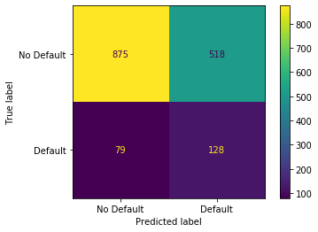
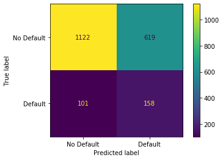

```python
# Import libraries
import re
import nltk

import pandas as pd
import numpy as np
import matplotlib.pyplot as plt

from nltk.corpus import stopwords
from nltk.tokenize import word_tokenize, sent_tokenize
from nltk.stem import PorterStemmer, SnowballStemmer, WordNetLemmatizer

import xgboost
from xgboost import XGBClassifier

from sklearn.preprocessing import MinMaxScaler
from sklearn.preprocessing import OneHotEncoder
from sklearn.model_selection import train_test_split, GridSearchCV
from sklearn.compose import make_column_transformer
from sklearn.pipeline import make_pipeline
from sklearn.feature_extraction.text import TfidfVectorizer
from sklearn.metrics import confusion_matrix, accuracy_score, plot_confusion_matrix

pd.set_option('display.max_columns', 500)
pd.set_option('display.max_rows', 50000)
```


```python
# Import data
df = pd.read_csv('data/dataset.csv')
```


```python
df['emp_title'].unique()
```


    array(['Time Warner Cable', 'Ottawa University', 'Kennedy Wilson', ...,
           'Weichert, Realtors', 'meadwestvaco', 'Rehab Alliance'],
          dtype=object)


```python
# Employer Title
```


```python
def emp_title(data, pattern, category_name):
    """
    Find patterns and return a list with the common category name for different patterns.
    For eg: If 'Walmart' appears in the following formats ('walmart', 'Wal-Mart', 'Walmart')
    """
    unique_names = data['emp_title'].unique() 
    matches = [pattern.findall(i) for i in unique_names if len(pattern.findall(i)) > 0]
    matches = [item for l in matches for item in l]
    return [category_name if i in matches else i for i in data['emp_title']]
    


def emp_title_patterns(data, col_name):
    """
    Identify and apply patterns of most common employer title and replace the remaining with Others!!
    """
    
    # Fill NA
#     data[col_name] = data[col_name].fillna('None')
    
    # US Army
    pattern = re.compile(r'[a-zA-Z\S]*^[uU][a-zA-Z\s\S]+[Aa][Rr][Mm][Yy][a-zA-Z\S]*')
    data[col_name] = emp_title(data, pattern, 'U.S. Army')

    # US Navy
    pattern = re.compile(r'^[uU][a-zA-Z\s\S]+[Nn][Aa][Vv][Yy][a-zA-Z\S]*')
    data[col_name] = emp_title(data, pattern, 'U.S. Navy')

    # Walmart
    pattern = re.compile(r'^[Ww][Aa][a-zA-Z\S]+[tT]$[a-zA-Z\S]*')
    data[col_name] = emp_title(data, pattern, 'Walmart')

    # Banks
    pattern = re.compile(r'[a-zA-Z\S\s]*[Bb][Aa][Nn][Kk][a-zA-Z\S\s]*')
    data[col_name] = emp_title(data, pattern, 'Banks')

    # AT&T
    pattern = re.compile(r'[a-zA-Z\S\s]*[Aa][Tt][&n][Tt][a-zA-Z\S\s]*')
    data[col_name] = emp_title(data, pattern, 'AT&T')

    # Air Force
    pattern = re.compile(r'[a-zA-Z\S\s]*Force[a-zA-Z\S\s]*')
    data[col_name] = emp_title(data, pattern, 'Air Force')

    # USPS
    pattern = re.compile(r'^[Uu][a-zA-Z\S\s]*[Pp][Oo][Ss][Tt][Aa][Ll][a-zA-Z\S\s]*')
    data[col_name] = emp_title(data, pattern, 'USPS')

    # USPS
    pattern = re.compile(r'^[Uu][Ss][Pp][Ss]')
    data[col_name] = emp_title(data, pattern, 'USPS')

    # Chase Bank
    pattern = re.compile(r'[a-zA-Z\S\s]*[Cc]hase[a-zA-Z\S\s]*')
    data[col_name] = emp_title(data, pattern, 'J.P. Morgan Chase')

    # IBM
    pattern = re.compile(r'[a-zA-Z\S\s]*[Ii][Bb][Mm][a-zA-Z\S\s]*')
    data[col_name] = emp_title(data, pattern, 'IBM')

    # University
    pattern = re.compile(r'[a-zA-Z\S\s]*[Uu][Nn][Ii][Vv][Ee][Rr][Ss][Ii][Tt][Yy][a-zA-Z\S\s]*')
    data[col_name] = emp_title(data, pattern, 'University')

    # Airlines
    pattern = re.compile(r'[a-zA-Z\S\s]*[Aa]irline[s]*[a-zA-Z\S\s]*')
    data[col_name] = emp_title(data, pattern, 'Airlines')

    # The Home Depot
    pattern = re.compile(r'[a-zA-Z\S\s]*[Hh][Oo][Mm][Ee]\s[Dd][Ee][Pp][Oo][Tt][a-zA-Z\S\s]*')
    data[col_name] = emp_title(data, pattern, 'The Home Depot')

    # Other
    top_category = ['None', 'Banks', 'University', 'U.S. Army', 'Air Force', 'USPS', 'Airlines', 'Walmart', 'J.P. Morgan Chase', 'IBM', 'U.S. Navy', 'The Home Depot', 'AT&T']
    data[col_name] = ['Other' if i not in top_category else i for i in data[col_name]] 
    
    return data[col_name]


```


```python
def lambda_nltk_notes(data, col_names):

    data[col_names] = data[col_names].fillna('None')
    stop_words = stopwords.words('english')
    stop_words.append('br/')
    special_char = re.compile(r'[\W]')
    ps = PorterStemmer()
    lemmatizer = WordNetLemmatizer()

    sample = []
    for index, note in enumerate(data[col_names]):
        word_tokens = word_tokenize(note)
        no_stops = [i for i in word_tokens if i.lower() not in stop_words]
        no_special = [special_char.sub('',i) for i in no_stops if special_char.sub('',i) != '']
        stem_lemma = " ".join(ps.stem(lemmatizer.lemmatize(i.lower())) for i in no_special)
        sample.append(stem_lemma)

    return sample
    
```


```python
# Apply Data Preprocessing
```


```python
def data_preprocessiong(data):
    
    # emp_title - CATEGORICAL
    data['emp_title'] = data['emp_title'].fillna('None')
    data['emp_title'] = emp_title_patterns(data, 'emp_title')
    
    # emp_length - NUMERICAL
    data['emp_length'] = [0 if i == 'na' else i for i in data['emp_length']]
    data['emp_length'] = data['emp_length'].astype(int)
    
    # home_ownership - CATEGORICAL
    data.drop(data[data['home_ownership']=='NONE'].index, inplace=True)
    
    # annual_inc - NUMERICAL
    data['annual_inc'] = data['annual_inc'].fillna(0)
    
    # verification_status - CATEGORICAL
    
    # Notes - TEXT
    data['Notes'] = lambda_nltk_notes(data, 'Notes')
    data['Notes'] = data['Notes'].astype(str)
    
    # purpose_cat - CATEGORICAL
    purpose_df = pd.DataFrame(data['purpose_cat'].value_counts())
    purpose_df.reset_index(inplace=True) 
    other_small_business = list(purpose_df.loc[purpose_df['purpose_cat'] < 90, 'index'])
    data.loc[:,'purpose_cat'] = [i if i not in other_small_business else 'other small business' for i in data['purpose_cat']]
    
    # addr_state - CATEGORICAL
    
    # debt_to_income - NUMERICAL
    
    # delinq_2yrs - NUMERICAL
    data['delinq_2yrs'] = data['delinq_2yrs'].fillna(0.0)
    
    # earliest_cr_line - CATEGORICAL
    data['quarter'] = [str(i.quarter) for i in pd.to_datetime(data['earliest_cr_line'])]
    data['year'] = [str(i.year) for i in pd.to_datetime(data['earliest_cr_line'])]
    
    #### replace less frequent with 'Other' 
    cr_line_df = pd.DataFrame(data['year'].value_counts())
    cr_line_df.reset_index(inplace=True) 
    other_years = list(cr_line_df.loc[cr_line_df['year'] < 90, 'index'])
    data.loc[:,'year'] = [i if i not in other_years else 'other' for i in data['year']]

    # inq_last_6mths - NUMERICAL
    data['inq_last_6mths'] = data['inq_last_6mths'].fillna(0)
    
    # mths_since_last_delinq - NUMERICAL
    data['mths_since_last_delinq'] = data['mths_since_last_delinq'].fillna(0)
    
    # mths_since_last_record - NUMERICAL
    data['mths_since_last_record'] = data['mths_since_last_record'].fillna(0)
    
    # open_acc - NUMERICAL
    data['open_acc'] = data['open_acc'].fillna(data['open_acc'].mean())
    
    # pub_rec - NUMERICAL
    data['pub_rec'] = data['pub_rec'].fillna(0.0)
    
    # revol_bal - NUMERICAL
    
    # revol_util - NUMERICAL
    data['revol_util'] = data['revol_util'].fillna(data['revol_util'].mean())
    
    # total_acc - NUMERICAL
    data['total_acc'] = data['total_acc'].fillna(data['total_acc'].mean())
    
    # mths_since_last_major_derog - NUMERICAL
    
    # policy_code - CATEGORICAL
    
    # Drop columns
    data.drop(columns=['Id', 'pymnt_plan', 'purpose', 'initial_list_status', 'collections_12_mths_ex_med', 'earliest_cr_line', 'zip_code'], axis=1, inplace=True)
    
    return data
```


```python
X = df.loc[:,~df.columns.isin(['is_bad'])].copy()
y = df['is_bad']

X, X_test, y, y_test = train_test_split(X, y,
                                        test_size=0.20,
                                        random_state=1,
                                        stratify=y)

X_train, X_val, y_train, y_val = train_test_split(X, y,
                                                  test_size=0.20,
                                                  random_state=1,
                                                  stratify=y)

```


```python
print(X_train.shape, X_val.shape, X_test.shape)
print(y_train.shape, y_val.shape, y_test.shape)
```

    (6400, 27) (1600, 27) (2000, 27)
    (6400,) (1600,) (2000,)


```python
y_train.drop(X_train[X_train['home_ownership']=='NONE'].index[0], inplace=True)
```


```python
X_train = data_preprocessiong(X_train)
X_val = data_preprocessiong(X_val)
X_test = data_preprocessiong(X_test)
```

    /opt/anaconda3/lib/python3.7/site-packages/ipykernel_launcher.py:4: SettingWithCopyWarning: 
    A value is trying to be set on a copy of a slice from a DataFrame.
    Try using .loc[row_indexer,col_indexer] = value instead
    
    See the caveats in the documentation: https://pandas.pydata.org/pandas-docs/stable/user_guide/indexing.html#returning-a-view-versus-a-copy
      after removing the cwd from sys.path.
    /opt/anaconda3/lib/python3.7/site-packages/ipykernel_launcher.py:23: SettingWithCopyWarning: 
    A value is trying to be set on a copy of a slice from a DataFrame.
    Try using .loc[row_indexer,col_indexer] = value instead
    
    See the caveats in the documentation: https://pandas.pydata.org/pandas-docs/stable/user_guide/indexing.html#returning-a-view-versus-a-copy
    /opt/anaconda3/lib/python3.7/site-packages/ipykernel_launcher.py:27: SettingWithCopyWarning: 
    A value is trying to be set on a copy of a slice from a DataFrame.
    Try using .loc[row_indexer,col_indexer] = value instead
    
    See the caveats in the documentation: https://pandas.pydata.org/pandas-docs/stable/user_guide/indexing.html#returning-a-view-versus-a-copy
    /opt/anaconda3/lib/python3.7/site-packages/ipykernel_launcher.py:31: SettingWithCopyWarning: 
    A value is trying to be set on a copy of a slice from a DataFrame.
    Try using .loc[row_indexer,col_indexer] = value instead
    
    See the caveats in the documentation: https://pandas.pydata.org/pandas-docs/stable/user_guide/indexing.html#returning-a-view-versus-a-copy
    /opt/anaconda3/lib/python3.7/site-packages/ipykernel_launcher.py:35: SettingWithCopyWarning: 
    A value is trying to be set on a copy of a slice from a DataFrame.
    Try using .loc[row_indexer,col_indexer] = value instead
    
    See the caveats in the documentation: https://pandas.pydata.org/pandas-docs/stable/user_guide/indexing.html#returning-a-view-versus-a-copy
    /opt/anaconda3/lib/python3.7/site-packages/ipykernel_launcher.py:39: SettingWithCopyWarning: 
    A value is trying to be set on a copy of a slice from a DataFrame.
    Try using .loc[row_indexer,col_indexer] = value instead
    
    See the caveats in the documentation: https://pandas.pydata.org/pandas-docs/stable/user_guide/indexing.html#returning-a-view-versus-a-copy
    /opt/anaconda3/lib/python3.7/site-packages/ipykernel_launcher.py:43: SettingWithCopyWarning: 
    A value is trying to be set on a copy of a slice from a DataFrame.
    Try using .loc[row_indexer,col_indexer] = value instead
    
    See the caveats in the documentation: https://pandas.pydata.org/pandas-docs/stable/user_guide/indexing.html#returning-a-view-versus-a-copy
    /opt/anaconda3/lib/python3.7/site-packages/ipykernel_launcher.py:47: SettingWithCopyWarning: 
    A value is trying to be set on a copy of a slice from a DataFrame.
    Try using .loc[row_indexer,col_indexer] = value instead
    
    See the caveats in the documentation: https://pandas.pydata.org/pandas-docs/stable/user_guide/indexing.html#returning-a-view-versus-a-copy
    /opt/anaconda3/lib/python3.7/site-packages/ipykernel_launcher.py:51: SettingWithCopyWarning: 
    A value is trying to be set on a copy of a slice from a DataFrame.
    Try using .loc[row_indexer,col_indexer] = value instead
    
    See the caveats in the documentation: https://pandas.pydata.org/pandas-docs/stable/user_guide/indexing.html#returning-a-view-versus-a-copy
    /opt/anaconda3/lib/python3.7/site-packages/ipykernel_launcher.py:55: SettingWithCopyWarning: 
    A value is trying to be set on a copy of a slice from a DataFrame.
    Try using .loc[row_indexer,col_indexer] = value instead
    
    See the caveats in the documentation: https://pandas.pydata.org/pandas-docs/stable/user_guide/indexing.html#returning-a-view-versus-a-copy
    /opt/anaconda3/lib/python3.7/site-packages/ipykernel_launcher.py:59: SettingWithCopyWarning: 
    A value is trying to be set on a copy of a slice from a DataFrame.
    Try using .loc[row_indexer,col_indexer] = value instead
    
    See the caveats in the documentation: https://pandas.pydata.org/pandas-docs/stable/user_guide/indexing.html#returning-a-view-versus-a-copy
    /opt/anaconda3/lib/python3.7/site-packages/ipykernel_launcher.py:63: SettingWithCopyWarning: 
    A value is trying to be set on a copy of a slice from a DataFrame.
    Try using .loc[row_indexer,col_indexer] = value instead
    
    See the caveats in the documentation: https://pandas.pydata.org/pandas-docs/stable/user_guide/indexing.html#returning-a-view-versus-a-copy
    /opt/anaconda3/lib/python3.7/site-packages/ipykernel_launcher.py:67: SettingWithCopyWarning: 
    A value is trying to be set on a copy of a slice from a DataFrame.
    Try using .loc[row_indexer,col_indexer] = value instead
    
    See the caveats in the documentation: https://pandas.pydata.org/pandas-docs/stable/user_guide/indexing.html#returning-a-view-versus-a-copy
    /opt/anaconda3/lib/python3.7/site-packages/ipykernel_launcher.py:71: SettingWithCopyWarning: 
    A value is trying to be set on a copy of a slice from a DataFrame.
    Try using .loc[row_indexer,col_indexer] = value instead
    
    See the caveats in the documentation: https://pandas.pydata.org/pandas-docs/stable/user_guide/indexing.html#returning-a-view-versus-a-copy
    /opt/anaconda3/lib/python3.7/site-packages/ipykernel_launcher.py:75: SettingWithCopyWarning: 
    A value is trying to be set on a copy of a slice from a DataFrame.
    Try using .loc[row_indexer,col_indexer] = value instead
    
    See the caveats in the documentation: https://pandas.pydata.org/pandas-docs/stable/user_guide/indexing.html#returning-a-view-versus-a-copy
    /opt/anaconda3/lib/python3.7/site-packages/ipykernel_launcher.py:5: SettingWithCopyWarning: 
    A value is trying to be set on a copy of a slice from a DataFrame.
    Try using .loc[row_indexer,col_indexer] = value instead
    
    See the caveats in the documentation: https://pandas.pydata.org/pandas-docs/stable/user_guide/indexing.html#returning-a-view-versus-a-copy
      """
    /opt/anaconda3/lib/python3.7/site-packages/ipykernel_launcher.py:8: SettingWithCopyWarning: 
    A value is trying to be set on a copy of a slice from a DataFrame.
    Try using .loc[row_indexer,col_indexer] = value instead
    
    See the caveats in the documentation: https://pandas.pydata.org/pandas-docs/stable/user_guide/indexing.html#returning-a-view-versus-a-copy
      
    /opt/anaconda3/lib/python3.7/site-packages/ipykernel_launcher.py:9: SettingWithCopyWarning: 
    A value is trying to be set on a copy of a slice from a DataFrame.
    Try using .loc[row_indexer,col_indexer] = value instead
    
    See the caveats in the documentation: https://pandas.pydata.org/pandas-docs/stable/user_guide/indexing.html#returning-a-view-versus-a-copy
      if __name__ == '__main__':
    /opt/anaconda3/lib/python3.7/site-packages/pandas/core/frame.py:3997: SettingWithCopyWarning: 
    A value is trying to be set on a copy of a slice from a DataFrame
    
    See the caveats in the documentation: https://pandas.pydata.org/pandas-docs/stable/user_guide/indexing.html#returning-a-view-versus-a-copy
      errors=errors,
    /opt/anaconda3/lib/python3.7/site-packages/ipykernel_launcher.py:15: SettingWithCopyWarning: 
    A value is trying to be set on a copy of a slice from a DataFrame.
    Try using .loc[row_indexer,col_indexer] = value instead
    
    See the caveats in the documentation: https://pandas.pydata.org/pandas-docs/stable/user_guide/indexing.html#returning-a-view-versus-a-copy
      from ipykernel import kernelapp as app
    /opt/anaconda3/lib/python3.7/site-packages/ipykernel_launcher.py:3: SettingWithCopyWarning: 
    A value is trying to be set on a copy of a slice from a DataFrame.
    Try using .loc[row_indexer,col_indexer] = value instead
    
    See the caveats in the documentation: https://pandas.pydata.org/pandas-docs/stable/user_guide/indexing.html#returning-a-view-versus-a-copy
      This is separate from the ipykernel package so we can avoid doing imports until
    /opt/anaconda3/lib/python3.7/site-packages/ipykernel_launcher.py:20: SettingWithCopyWarning: 
    A value is trying to be set on a copy of a slice from a DataFrame.
    Try using .loc[row_indexer,col_indexer] = value instead
    
    See the caveats in the documentation: https://pandas.pydata.org/pandas-docs/stable/user_guide/indexing.html#returning-a-view-versus-a-copy
    /opt/anaconda3/lib/python3.7/site-packages/ipykernel_launcher.py:21: SettingWithCopyWarning: 
    A value is trying to be set on a copy of a slice from a DataFrame.
    Try using .loc[row_indexer,col_indexer] = value instead
    
    See the caveats in the documentation: https://pandas.pydata.org/pandas-docs/stable/user_guide/indexing.html#returning-a-view-versus-a-copy
    /opt/anaconda3/lib/python3.7/site-packages/pandas/core/indexing.py:965: SettingWithCopyWarning: 
    A value is trying to be set on a copy of a slice from a DataFrame.
    Try using .loc[row_indexer,col_indexer] = value instead
    
    See the caveats in the documentation: https://pandas.pydata.org/pandas-docs/stable/user_guide/indexing.html#returning-a-view-versus-a-copy
      self.obj[item] = s
    /opt/anaconda3/lib/python3.7/site-packages/ipykernel_launcher.py:34: SettingWithCopyWarning: 
    A value is trying to be set on a copy of a slice from a DataFrame.
    Try using .loc[row_indexer,col_indexer] = value instead
    
    See the caveats in the documentation: https://pandas.pydata.org/pandas-docs/stable/user_guide/indexing.html#returning-a-view-versus-a-copy
    /opt/anaconda3/lib/python3.7/site-packages/ipykernel_launcher.py:37: SettingWithCopyWarning: 
    A value is trying to be set on a copy of a slice from a DataFrame.
    Try using .loc[row_indexer,col_indexer] = value instead
    
    See the caveats in the documentation: https://pandas.pydata.org/pandas-docs/stable/user_guide/indexing.html#returning-a-view-versus-a-copy
    /opt/anaconda3/lib/python3.7/site-packages/ipykernel_launcher.py:38: SettingWithCopyWarning: 
    A value is trying to be set on a copy of a slice from a DataFrame.
    Try using .loc[row_indexer,col_indexer] = value instead
    
    See the caveats in the documentation: https://pandas.pydata.org/pandas-docs/stable/user_guide/indexing.html#returning-a-view-versus-a-copy
    /opt/anaconda3/lib/python3.7/site-packages/ipykernel_launcher.py:50: SettingWithCopyWarning: 
    A value is trying to be set on a copy of a slice from a DataFrame.
    Try using .loc[row_indexer,col_indexer] = value instead
    
    See the caveats in the documentation: https://pandas.pydata.org/pandas-docs/stable/user_guide/indexing.html#returning-a-view-versus-a-copy
    /opt/anaconda3/lib/python3.7/site-packages/ipykernel_launcher.py:53: SettingWithCopyWarning: 
    A value is trying to be set on a copy of a slice from a DataFrame.
    Try using .loc[row_indexer,col_indexer] = value instead
    
    See the caveats in the documentation: https://pandas.pydata.org/pandas-docs/stable/user_guide/indexing.html#returning-a-view-versus-a-copy
    /opt/anaconda3/lib/python3.7/site-packages/ipykernel_launcher.py:56: SettingWithCopyWarning: 
    A value is trying to be set on a copy of a slice from a DataFrame.
    Try using .loc[row_indexer,col_indexer] = value instead
    
    See the caveats in the documentation: https://pandas.pydata.org/pandas-docs/stable/user_guide/indexing.html#returning-a-view-versus-a-copy
    /opt/anaconda3/lib/python3.7/site-packages/ipykernel_launcher.py:64: SettingWithCopyWarning: 
    A value is trying to be set on a copy of a slice from a DataFrame.
    Try using .loc[row_indexer,col_indexer] = value instead
    
    See the caveats in the documentation: https://pandas.pydata.org/pandas-docs/stable/user_guide/indexing.html#returning-a-view-versus-a-copy


```python
# Column Transformation
```


```python
# Training Set
```


```python
df.select_dtypes(include='object').columns
```


    Index(['emp_title', 'emp_length', 'home_ownership', 'verification_status',
           'pymnt_plan', 'Notes', 'purpose_cat', 'purpose', 'zip_code',
           'addr_state', 'earliest_cr_line', 'initial_list_status', 'policy_code'],
          dtype='object')


```python
df.select_dtypes(include=['int64', 'float64']).columns
```


    Index(['Id', 'is_bad', 'annual_inc', 'debt_to_income', 'delinq_2yrs',
           'inq_last_6mths', 'mths_since_last_delinq', 'mths_since_last_record',
           'open_acc', 'pub_rec', 'revol_bal', 'revol_util', 'total_acc',
           'collections_12_mths_ex_med', 'mths_since_last_major_derog'],
          dtype='object')


```python
ohe = OneHotEncoder(sparse=False, handle_unknown='ignore') 
cat_x_train = ohe.fit_transform(X_train[['emp_title', 'home_ownership', 'verification_status', 
                                         'purpose_cat', 'addr_state', 'policy_code', 'quarter', 'year']])

mmscaler = MinMaxScaler(feature_range=(0,1))
num_x_train = mmscaler.fit_transform(X_train[['emp_length', 'annual_inc', 'debt_to_income', 'delinq_2yrs',
                                'inq_last_6mths', 'open_acc', 'pub_rec', 'revol_bal', 
                                'revol_util', 'total_acc', 'mths_since_last_major_derog', 
                                'mths_since_last_record', 'mths_since_last_delinq']])

tf = TfidfVectorizer(min_df=1, stop_words='english', lowercase=True)
text_x_train = tf.fit_transform(X_train['Notes']).toarray()

X_train = np.concatenate((cat_x_train, num_x_train, text_x_train), axis=1)
```


```python
# Eval Set
```


```python
cat_x_val = ohe.transform(X_val[['emp_title', 'home_ownership', 'verification_status', 
                                 'purpose_cat', 'addr_state', 'policy_code', 'quarter', 'year']])

num_x_val = mmscaler.transform(X_val[['emp_length', 'annual_inc', 'debt_to_income', 'delinq_2yrs',
                                'inq_last_6mths', 'open_acc', 'pub_rec', 'revol_bal', 
                                'revol_util', 'total_acc', 'mths_since_last_major_derog', 
                                'mths_since_last_record', 'mths_since_last_delinq']])

text_x_val = tf.transform(X_val['Notes']).toarray()

X_val = np.concatenate((cat_x_val, num_x_val, text_x_val), axis=1)
X_val.shape
```


    (1600, 9885)


```python
# Test Set
```


```python
cat_x_test = ohe.transform(X_test[['emp_title', 'home_ownership', 'verification_status', 
                                   'purpose_cat', 'addr_state', 'policy_code', 'quarter', 'year']])

num_x_test = mmscaler.transform(X_test[['emp_length', 'annual_inc', 'debt_to_income', 'delinq_2yrs',
                                'inq_last_6mths', 'open_acc', 'pub_rec', 'revol_bal', 
                                'revol_util', 'total_acc', 'mths_since_last_major_derog', 
                                'mths_since_last_record', 'mths_since_last_delinq']])

text_x_test = tf.transform(X_test['Notes']).toarray()

X_test = np.concatenate((cat_x_test, num_x_test, text_x_test), axis=1)
X_test.shape
```


    (2000, 9885)


```python
print(X_train.shape, y_train.shape)
```

    (6399, 9885) (6399,)


```python
optimized_classifier = XGBClassifier(objective='binary:logistic',
                                     gamma=10.0,
                                     learning_rate=0.1,
                                     max_depth=3,
                                     reg_lambda=100.0,
                                     scale_pos_weight=7,
                                     use_label_encoder=False,
                                     subsample=0.95,
                                     colsample_bytree=0.5,
                                     seed=10)

model = optimized_classifier.fit(X_train,
                                 y_train,
                                 early_stopping_rounds=10,
                                 verbose=True,
                                 eval_metric='aucpr',
                                 eval_set=[(X_train, y_train), (X_val, y_val)])

plot_confusion_matrix(optimized_classifier,
                      X_val,
                      y_val,
                      values_format='d',
                      display_labels=["No Default",
                                      "Default"])

plot_confusion_matrix(optimized_classifier,
                      X_test,
                      y_test,
                      values_format='d',
                      display_labels=["No Default",
                                      "Default"])

```

    [0]	validation_0-aucpr:0.18182	validation_1-aucpr:0.14960
    [1]	validation_0-aucpr:0.21049	validation_1-aucpr:0.15041
    [2]	validation_0-aucpr:0.22096	validation_1-aucpr:0.15675
    [3]	validation_0-aucpr:0.29287	validation_1-aucpr:0.17825
    [4]	validation_0-aucpr:0.29859	validation_1-aucpr:0.17883
    [5]	validation_0-aucpr:0.32106	validation_1-aucpr:0.18272
    [6]	validation_0-aucpr:0.32411	validation_1-aucpr:0.18416
    [7]	validation_0-aucpr:0.33225	validation_1-aucpr:0.18440
    [8]	validation_0-aucpr:0.33382	validation_1-aucpr:0.18623
    [9]	validation_0-aucpr:0.33042	validation_1-aucpr:0.18630
    [10]	validation_0-aucpr:0.33615	validation_1-aucpr:0.18684
    [11]	validation_0-aucpr:0.33944	validation_1-aucpr:0.18718
    [12]	validation_0-aucpr:0.33965	validation_1-aucpr:0.18697
    [13]	validation_0-aucpr:0.34309	validation_1-aucpr:0.18909
    [14]	validation_0-aucpr:0.34513	validation_1-aucpr:0.18924
    [15]	validation_0-aucpr:0.34497	validation_1-aucpr:0.18955
    [16]	validation_0-aucpr:0.34883	validation_1-aucpr:0.19124
    [17]	validation_0-aucpr:0.35283	validation_1-aucpr:0.19129
    [18]	validation_0-aucpr:0.35310	validation_1-aucpr:0.19087
    [19]	validation_0-aucpr:0.35493	validation_1-aucpr:0.19035
    [20]	validation_0-aucpr:0.35441	validation_1-aucpr:0.19010
    [21]	validation_0-aucpr:0.35542	validation_1-aucpr:0.19131
    [22]	validation_0-aucpr:0.35493	validation_1-aucpr:0.19076
    [23]	validation_0-aucpr:0.35707	validation_1-aucpr:0.19095
    [24]	validation_0-aucpr:0.35872	validation_1-aucpr:0.19118
    [25]	validation_0-aucpr:0.35763	validation_1-aucpr:0.19082
    [26]	validation_0-aucpr:0.35799	validation_1-aucpr:0.19166
    [27]	validation_0-aucpr:0.36100	validation_1-aucpr:0.19265
    [28]	validation_0-aucpr:0.36206	validation_1-aucpr:0.19397
    [29]	validation_0-aucpr:0.36239	validation_1-aucpr:0.19410
    [30]	validation_0-aucpr:0.36430	validation_1-aucpr:0.19580
    [31]	validation_0-aucpr:0.36564	validation_1-aucpr:0.19682
    [32]	validation_0-aucpr:0.36608	validation_1-aucpr:0.19694
    [33]	validation_0-aucpr:0.36790	validation_1-aucpr:0.19722
    [34]	validation_0-aucpr:0.36926	validation_1-aucpr:0.19713
    [35]	validation_0-aucpr:0.36953	validation_1-aucpr:0.19750
    [36]	validation_0-aucpr:0.36949	validation_1-aucpr:0.19741
    [37]	validation_0-aucpr:0.36951	validation_1-aucpr:0.19803
    [38]	validation_0-aucpr:0.37131	validation_1-aucpr:0.19892
    [39]	validation_0-aucpr:0.37080	validation_1-aucpr:0.19897
    [40]	validation_0-aucpr:0.37407	validation_1-aucpr:0.19837
    [41]	validation_0-aucpr:0.37713	validation_1-aucpr:0.19967
    [42]	validation_0-aucpr:0.37783	validation_1-aucpr:0.19925
    [43]	validation_0-aucpr:0.37912	validation_1-aucpr:0.20043
    [44]	validation_0-aucpr:0.37967	validation_1-aucpr:0.20096
    [45]	validation_0-aucpr:0.38166	validation_1-aucpr:0.20083
    [46]	validation_0-aucpr:0.38253	validation_1-aucpr:0.20133
    [47]	validation_0-aucpr:0.38222	validation_1-aucpr:0.20134
    [48]	validation_0-aucpr:0.38504	validation_1-aucpr:0.20196
    [49]	validation_0-aucpr:0.38620	validation_1-aucpr:0.20031
    [50]	validation_0-aucpr:0.38675	validation_1-aucpr:0.20172
    [51]	validation_0-aucpr:0.38718	validation_1-aucpr:0.20230
    [52]	validation_0-aucpr:0.38860	validation_1-aucpr:0.20254
    [53]	validation_0-aucpr:0.39052	validation_1-aucpr:0.20446
    [54]	validation_0-aucpr:0.39167	validation_1-aucpr:0.20551
    [55]	validation_0-aucpr:0.39450	validation_1-aucpr:0.20646
    [56]	validation_0-aucpr:0.39664	validation_1-aucpr:0.20563
    [57]	validation_0-aucpr:0.39746	validation_1-aucpr:0.20654
    [58]	validation_0-aucpr:0.39959	validation_1-aucpr:0.20968
    [59]	validation_0-aucpr:0.40086	validation_1-aucpr:0.20975
    [60]	validation_0-aucpr:0.40271	validation_1-aucpr:0.21119
    [61]	validation_0-aucpr:0.40427	validation_1-aucpr:0.21194
    [62]	validation_0-aucpr:0.40406	validation_1-aucpr:0.21209
    [63]	validation_0-aucpr:0.40613	validation_1-aucpr:0.21271
    [64]	validation_0-aucpr:0.40708	validation_1-aucpr:0.21155
    [65]	validation_0-aucpr:0.40851	validation_1-aucpr:0.21164
    [66]	validation_0-aucpr:0.40804	validation_1-aucpr:0.21136
    [67]	validation_0-aucpr:0.40886	validation_1-aucpr:0.21154
    [68]	validation_0-aucpr:0.41174	validation_1-aucpr:0.21312
    [69]	validation_0-aucpr:0.41227	validation_1-aucpr:0.21345
    [70]	validation_0-aucpr:0.41242	validation_1-aucpr:0.21265
    [71]	validation_0-aucpr:0.41388	validation_1-aucpr:0.21303
    [72]	validation_0-aucpr:0.41455	validation_1-aucpr:0.21277
    [73]	validation_0-aucpr:0.41487	validation_1-aucpr:0.21283
    [74]	validation_0-aucpr:0.41686	validation_1-aucpr:0.21164
    [75]	validation_0-aucpr:0.41865	validation_1-aucpr:0.21202
    [76]	validation_0-aucpr:0.41875	validation_1-aucpr:0.21213
    [77]	validation_0-aucpr:0.42018	validation_1-aucpr:0.21204
    [78]	validation_0-aucpr:0.42170	validation_1-aucpr:0.21185
    [79]	validation_0-aucpr:0.42114	validation_1-aucpr:0.21197


    <sklearn.metrics._plot.confusion_matrix.ConfusionMatrixDisplay at 0x7fd7b50db110>








```python
# Model evaluation - Test-Validation Set
print('Validation Set Metrics: ')
print('-----------------------')
y_pred_val = optimized_classifier.predict(X_val)
cm = confusion_matrix(y_val, y_pred_val)
accuracy = accuracy_score(y_val, y_pred_val)
print('Confusion matrix: \n', cm)
print('\nF1 Score: ', 2*cm[1, 1]/(2*cm[1, 1]+cm[0, 1]+cm[1, 0]))
print('\nPrecision: ', cm[1, 1]/(cm[1, 1]+cm[0, 1]))
print('\nAccuracy: ', accuracy)
print('\nRecall/Sensitivity: ', cm[1, 1]/(cm[1, 1]+cm[1, 0]))
print('\nSpecificity: ', cm[0, 0]/(cm[0, 0]+cm[0, 1]))

print('\n')
print('Test Set Metrics: ')
print('-----------------')
y_pred_test = optimized_classifier.predict(X_test)
cm = confusion_matrix(y_test, y_pred_test)
accuracy = accuracy_score(y_test, y_pred_test)
print('Confusion matrix: \n', cm)
print('\nF1 Score: ', 2*cm[1, 1]/(2*cm[1, 1]+cm[0, 1]+cm[1, 0]))
print('\nPrecision: ', cm[1, 1]/(cm[1, 1]+cm[0, 1]))
print('\nAccuracy: ', accuracy)
print('\nRecall/Sensitivity: ', cm[1, 1]/(cm[1, 1]+cm[1, 0]))
print('\nSpecificity: ', cm[0, 0]/(cm[0, 0]+cm[0, 1]))

```

    Validation Set Metrics: 
    -----------------------
    Confusion matrix: 
     [[875 518]
     [ 79 128]]
    
    F1 Score:  0.30011723329425555
    
    Precision:  0.19814241486068113
    
    Accuracy:  0.626875
    
    Recall/Sensitivity:  0.6183574879227053
    
    Specificity:  0.628140703517588
    
    
    Test Set Metrics: 
    -----------------
    Confusion matrix: 
     [[1122  619]
     [ 101  158]]
    
    F1 Score:  0.305019305019305
    
    Precision:  0.20334620334620335
    
    Accuracy:  0.64
    
    Recall/Sensitivity:  0.61003861003861
    
    Specificity:  0.6444572085008615


```python

```
